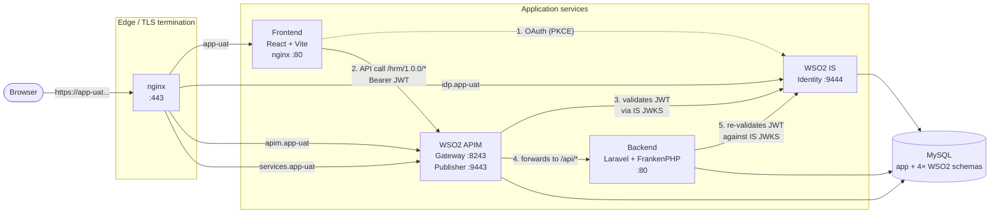

# EMIS HRM

Human Resources Management system for the Sri Lankan Ministry of Education. Laravel backend and React frontend, authenticated through WSO2 Identity Server, with WSO2 API Manager fronting all backend traffic. The same stack runs locally (Docker Compose) and in production (Docker Swarm).

## Architecture



**Request flow.** The browser authenticates with WSO2 Identity Server using OAuth 2.0 + PKCE and receives a JWT access token. Every backend API call from the frontend is made to the **APIM gateway** (`https://services.app-uat.emis.moe.gov.lk/hrm/1.0.0/...`), not directly to Laravel. APIM validates the token's signature against IS's JWKS, applies subscription and throttling policies, and forwards the request — with the original `Authorization` header intact — to Laravel. Laravel's `JwtGuard` re-validates the token against the same JWKS and resolves the user.

**Why APIM in the path.** Subscription/throttling/analytics policies are enforced at the gateway, and the architecture matches the published OpenAPI contract that the rest of the ministry's systems integrate against.

**Services.**

| Service     | Role                                                        |
| ----------- | ----------------------------------------------------------- |
| `frontend`  | React app served by nginx                                   |
| `backend`   | Laravel app served by FrankenPHP (Caddy + PHP)              |
| `wso2-is`   | Identity Server — OAuth/OIDC issuer, user store             |
| `wso2-apim` | API Manager — gateway, publisher portal, dev portal         |
| `mysql`     | Application DB + 4× WSO2 schemas (`*_db`, `*_shared_db`)    |
| `nginx-proxy` *(local only)* | Single TLS endpoint serving all UAT-mirror hostnames on 443 |

In production, a real load balancer terminates TLS. Locally, `nginx-proxy` plays that role so the same hostnames (`app-uat.emis.moe.gov.lk`, `api-uat.emis.moe.gov.lk`, etc.) work end-to-end without changing env files.

## Repo layout

```
backend/                       Laravel app + Dockerfile
frontend/                      React app + Dockerfile
is/                            WSO2 IS image build (deployment.toml, etc.)
apim/                          WSO2 APIM image build
infrastructure/
  docker-swarm/                Authoritative deploy config — used for prod swarm AND local compose
    docker-stack.yml             Base stack file. Untouched between prod and local.
    docker-compose.local.yml     Local-dev override (bridge net, restart keys, mysql, build directives)
    nginx-proxy/                 Local-only TLS-terminating reverse proxy
    *.env                        Runtime config (gitignored — copy from *.env.example)
    .env                         Image repo/tag vars (gitignored — copy from .env.example)
    scripts/setup.sh             One-shot local bootstrap
    scripts/rebuild.sh           Rebuild + restart a single service after a code change
    scripts/configure-auth.sh    Harvest OAuth credentials from IS into env files (re-runnable)
  ansible/                     Configuration playbooks (IS/APIM setup, users/roles/APIs)
    playbooks/configure-is-and-apim.yml   Register IS as APIM Key Manager + provision roles/users/APIs/apps
    resources/users-roles.yml             Source of truth for roles, test users, APIs, and applications
    templates/                            Jinja2 env file templates for ansible-driven deploys
    vars.yml                              Operator-provided variables (gitignored; see vars.yml.example)
```

## Local development

The local setup mirrors production: it uses the same `docker-stack.yml` plus a local override that adds `build:` directives, a bundled MySQL container, and the `nginx-proxy` TLS terminator.

### Prerequisites

- Docker + Docker Compose v2
- Ansible (with `community.docker` collection installed)
- Host ports `443`, `9000`, `9443`, `9444`, `3308` available

Add the following to `/etc/hosts` (the setup script prints these again on first run):

```
127.0.0.1 app-uat.emis.moe.gov.lk api-uat.emis.moe.gov.lk idp.app-uat.emis.moe.gov.lk apim.app-uat.emis.moe.gov.lk services.app-uat.emis.moe.gov.lk
```

### First-time setup

```bash
cd infrastructure/docker-swarm
./scripts/setup.sh
```

The script will:

1. Copy any missing `*.env` files from their `*.env.example` counterparts.
2. Build the four service images locally (WSO2 IS, WSO2 APIM, frontend, backend).
3. Start MySQL and seed the four WSO2 schemas (`latin1` charset) by invoking the bundled ansible playbook.
4. Start the rest of the stack.
5. Wait for IS and APIM to finish booting (~2 min combined).
6. Run `configure-is-and-apim.yml` to register IS as the APIM Key Manager, create roles, seed test users, and publish the `EMIS-HRM` API.
7. Run `configure-auth.sh` to harvest the freshly generated OAuth credentials into `frontend.env` and `backend.env`, then rebuild the frontend (Vite bakes `VITE_*` at build time).

First run takes 10–20 minutes (multi-GB WSO2 base images).

### URLs and test users

| Service       | URL                                                  |
| ------------- | ---------------------------------------------------- |
| Frontend      | https://app-uat.emis.moe.gov.lk                      |
| Backend       | https://api-uat.emis.moe.gov.lk *(via APIM in normal use)* |
| APIM Gateway  | https://services.app-uat.emis.moe.gov.lk             |
| IS Carbon     | https://idp.app-uat.emis.moe.gov.lk/carbon           |
| APIM Carbon   | https://apim.app-uat.emis.moe.gov.lk/carbon          |
| MySQL         | `localhost:3308` (user `emis` / password `emis`)     |

The proxy uses a self-signed cert — the browser will warn the first time you hit each hostname; accept and continue. WSO2 Carbon admin credentials are in `is.env` (`IS_ADMIN_PASSWORD`) and `apim.env` (`APIM_ADMIN_PASSWORD`).

Test users (seeded by `users-roles.yml`):

| Username     | Password         | Role        |
| ------------ | ---------------- | ----------- |
| `teacher1`   | `Teacher@123`    | Teacher     |
| `principal1` | `Principal@123`  | Principal   |
| `dataentry1` | `DataEntry@123`  | DataEntry   |

### Day-to-day

After changing code in `backend/` or `frontend/`:

```bash
cd infrastructure/docker-swarm
./scripts/rebuild.sh backend      # or frontend / wso2-is / wso2-apim / all
```

`rebuild.sh` rebuilds the image, restarts only that container (`--no-deps`, so MySQL keeps running), and tails the logs. For frontend changes specifically, the script sources `frontend.env` first so that the `VITE_*` build args reach the Vite build inside the image.

### Common commands

All from `infrastructure/docker-swarm/`:

```bash
# Raw compose handle the scripts use
docker compose -f docker-stack.yml -f docker-compose.local.yml <subcommand>

# Status / logs
docker compose -f docker-stack.yml -f docker-compose.local.yml ps
docker compose -f docker-stack.yml -f docker-compose.local.yml logs -f backend

# Stop everything
docker compose -f docker-stack.yml -f docker-compose.local.yml down

# Stop + wipe local MySQL data
docker compose -f docker-stack.yml -f docker-compose.local.yml down -v
```

### Re-harvesting OAuth credentials

WSO2 IS issues fresh `client_id` / `client_secret` values every time `configure-is-and-apim.yml` runs. If you re-run that playbook (or wipe IS state), the SPA and M2M credentials in `frontend.env` / `backend.env` go stale. To resync without re-running the full setup:

```bash
./scripts/configure-auth.sh
```

This queries IS for the current `EMIS Web App` (SPA) and `CEMIS-LK M2M` credentials, writes them into the env files, rebuilds the frontend, and restarts the backend.

## Production deployment

Production runs the same `docker-stack.yml` on a Docker Swarm node. Unlike local-dev, several preconditions are handled out-of-band:

- **MySQL is already provisioned** with the 4 WSO2 schemas (`wso2_apim_db`, `wso2_apim_shared_db`, `wso2_is_db`, `wso2_is_shared_db` — all `latin1`) and the EMIS application database. The `mysql-*.yml` playbooks in this repo are **not** run against prod.
- **Docker Swarm node exists** and the operator has shell + docker access on the manager.
- **TLS termination** is handled by an external load balancer (not by the `nginx-proxy` container, which is local-dev only).
- **Image registry** is reachable; tags for all four services are pinned in `.env` on the swarm node.

### Deploy steps

1. **Set up env files on the swarm node.** Copy each `*.env.example` to `*.env` and fill in real values. The `.env` file (image repo/tag vars) is referenced by `docker-stack.yml` for image resolution. The `*.env` files (`frontend.env`, `backend.env`, `is.env`, `apim.env`) are loaded into the corresponding containers at runtime.

2. **Deploy the stack** (manual, on the swarm manager):

   ```bash
   docker stack deploy -c docker-stack.yml emis
   ```

   Watch services come up:

   ```bash
   docker stack services emis
   docker service logs -f emis_wso2-is
   ```

   Wait for IS and APIM to finish booting — `/carbon/admin/login.jsp` returning HTTP 200 is the readiness signal.

3. **Configure IS + APIM** (run from a control host with ansible installed and SSH/HTTPS access to the swarm node's IS and APIM admin endpoints):

   ```bash
   cd infrastructure/ansible
   ansible-playbook playbooks/configure-is-and-apim.yml \
     -e @resources/users-roles.yml
   ```

   This registers IS as APIM's Key Manager, creates roles, provisions users, imports the `EMIS-HRM` API from the backend's OpenAPI spec, and creates the `EMIS Web App` and `CEMIS-LK M2M` applications. Inventory and credentials come from `infrastructure/ansible/inventory/hosts.yml` and `infrastructure/ansible/vars.yml`.

   The playbook prints the generated OAuth credentials at the end — capture them.

4. **Paste OAuth credentials into the env files on the swarm node.** From the playbook output, take:

   | From playbook output      | Goes into                                | Used by                           |
   | ------------------------- | ---------------------------------------- | --------------------------------- |
   | EMIS Web App `client_id`  | `VITE_ASGARDEO_CLIENT_ID` in `frontend.env` | Frontend OAuth login              |
   | CEMIS-LK M2M `client_id`     | `ASGARDEO_CLIENT_ID` in `backend.env`    | Backend SCIM2 user-provisioning   |
   | CEMIS-LK M2M `client_secret` | `ASGARDEO_CLIENT_SECRET` in `backend.env` | Backend SCIM2 user-provisioning   |

   For traceability, also update `infrastructure/ansible/vars.yml`:
   - `varsfl_vite_asgardeo_client_id`
   - `varsfl_wso2_m2m_client_id`
   - `varsfl_wso2_m2m_client_secret`
   - `varsfl_vite_api_base_url` should be `https://services.<your-domain>/hrm/1.0.0` so frontend traffic routes through APIM.

5. **Re-deploy to pick up the new env values.** Vite bakes `VITE_*` at build time, so the frontend image must be rebuilt with the new `VITE_ASGARDEO_CLIENT_ID`. After publishing the rebuilt frontend image (and pinning its new tag in `.env`), re-deploy:

   ```bash
   docker stack deploy -c docker-stack.yml emis
   ```

   Swarm will recreate any service whose image tag or env changed.

### Updating production

For a routine code-only update:

1. Build and publish new `emis-backend:<tag>` or `emis-frontend:<tag>` images.
2. Update the matching `*_DOCKERIMG_TAG` in `.env` on the swarm node.
3. `docker stack deploy -c docker-stack.yml emis`.

For changes that affect IS or APIM configuration (new roles, new APIs, new test users), re-run `configure-is-and-apim.yml` — it's idempotent against existing resources, but the OAuth credential paste step in (4) must be repeated since IS reissues them on each run.

## Env file conventions

- `*.env` files (`apim.env`, `backend.env`, `frontend.env`, `is.env`, and the image-tag `.env`) are **gitignored**.
- `*.env.example` files are **committed** — they document the schema with secrets blanked.
- When adding a new variable, update both the real file (locally and on the swarm node) and the example.
- `infrastructure/docker/docker-compose.yml` and the `deploy-*.yml` ansible playbooks are **older artifacts** from a pre-swarm deploy path and are not part of the current prod flow.

## License

See `LICENSE`.
